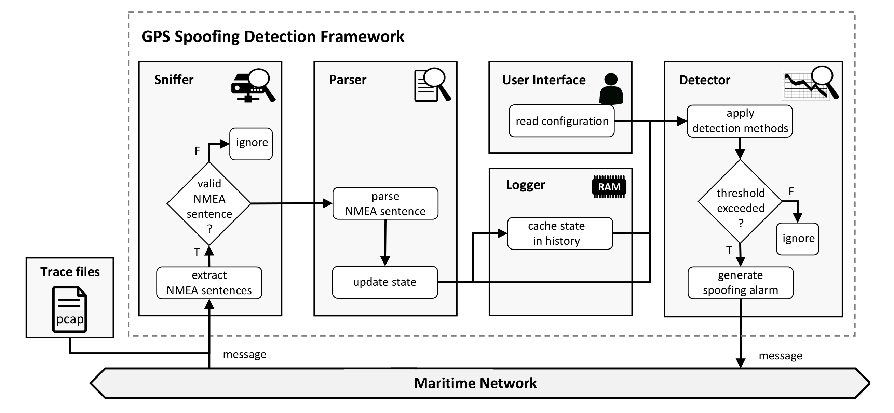

# MANA: Maritime NMEA-based Anomaly Detection

By Julian Spravil, Christian Hemminghaus, Merlin von Rechenberg, Elmar Padilla, and Jan Bauer.

Official implementation of **[Detecting Maritime GPS Spoofing Attacks Based on NMEA Sentence Integrity Monitoring](https://www.mdpi.com/2077-1312/11/5/928)** (DOI 10.3390/jmse11050928).

The **MARSIM dataset** can be found at zenodo.org:  [](https://doi.org/10.5281/zenodo.8202802)

> **Abstract**
> 
> Today’s maritime transportation relies on global navigation satellite systems (GNSSs) for accurate navigation. The high-precision GNSS receivers on board modern vessels are often considered trustworthy. However, due to technological advances and malicious activities, this assumption is no longer always true. Numerous incidents of tampered GNSS signals have been reported. Furthermore, researchers have demonstrated that manipulations can be carried out even with inexpensive hardware and little expert knowledge, lowering the barrier for malicious attacks with far-reaching consequences. Hence, exclusive trust in GNSS is misplaced, and methods for reliable detection are urgently needed. However, many of the proposed solutions require expensive replacement of existing hardware. In this paper, therefore, we present MAritime Nmea-based Anomaly detection (MANA), a novel low-cost framework for GPS spoofing detection. MANA monitors NMEA-0183 data and advantageously combines several software-based methods. Using simulations supported by real-world experiments that generate an extensive dataset, we investigate our approach and finally evaluate its effectiveness.

## Getting Started

The code is tested with Python 3.8. The required packages can be installed with the following command:
```
python setup.py install
```

To run our examples, the MARSIM Dataset `marsim_dataset.tar.bz2` needs to downloaded from [zenodo](https://doi.org/10.5281/zenodo.8202802). Extract the dataset and place the files into the relative directory ```data/dataset/```. For more details, view the [dataset README](README_MARSIM.md).

## Examples

Two examples can be found in the folder ```examples/```.
The first example ```detect_spoofing_attack_in_dataset.py``` performs spoofing detection on each pcap-file within the dataset.
Based on the results and the ground truth data, the precision, recall, and f1 score are calculated.
The detection methods and their settings are stored in the file ```methods.json```.
```
python examples/detect_spoofing_attack_in_dataset.py
```

The second example ```detect_spoofing_attack_in_network.py``` collects NMEA sentences directly from the network interface of the current device.
A notification is printed to the console if one method detects a spoofing attack.
Run one of the following commands:
```
python examples/detect_spoofing_attack_in_network.py
```

## Components



MANA offers a modular structure.
The first module, the ```Feeder``` class, collects the NMEA sentences from files or data streams.
Furthermore, the class starts the detection process with the ```run()``` function.
The sentences are then passed to an instance of the ```Handler``` class that executes a collection of different methods.
The handler also executes sentence parsing, creates a state from the data stream, and stores state for methods that require temporal information.

### Methods

The available methods are listed below.
Thereby, we describe the available settings that need to be modified to fit the detection framework to different systems.
The settings are defined within the file `methods.json`.
Note that the framework allows for the easy addition of new methods.

#### MultipleReceiversMethod

The multiple receivers method or Pairwise Distance Monitoring (PDM) keeps track of the distance between pairs of GPS receivers.
A spoofing attack is likely if the distance falls below a certain threshold.
```
[...]
"distances": {
  "192.168.0.10, 192.168.0.11": 4 // Distance between the GPS receivers with the corresponding IP addresses
},
"distance_ratio_thresholds": {
  "192.168.0.10, 192.168.0.11": 0.5 // The distance may not be less than 50% of the actual distance to remain valid
}, 
[...]
```

#### PhysicalSpeedLimitMethod

The physical speed limit method or Physical Cross-Check for Speed Over Ground (PCC_sog) validates that the vessel stays in reasonable speed ranges.
```
[...]
"max_speed": 30, // Maximum speed of the vehicle
[...]
```

#### PhysicalRateOfTurnLimitMethod

The physical rate of turn limit method or Physical Cross-Check for Rate of Turn (PCC_rot) validates that the turning rate of the vehicle is reasonable.
However, this method requires a certain speed to function properly.
```
[...]
"max_rate_of_turn": 7.5, // Maximum rate of turn
"min_speed_to_determine_rate_of_turn": 15, // The speed required to activate this method to avoid false positives
[...]
```

#### PhysicalHeightLimitMethod

The physical height limit method or Physical Cross-Check for Height (PCC_height) validates that the altitude of the vessel is at sea level.
```
[...]
"min_height": -1,
"max_height": 1,
[...]
```

#### PhysicalEnvironmentLimitMethod

The physical environment limit method or Physical Cross-Check for Environment (PCC_env) ensures that a vehicle is positioned within the correct terrain.
The resolution of the file `src/mana/method/water_map.png` can be adjusted to increase the method's accuracy.

#### OrbitPositionsMethod

The orbit positions method or Ephemeris Data Validation (EDV) compares the observed with the predicted satellite positions.
Furthermore, the visibility of a satellite is checked.
Note that the file `src/mana/method/gps.tle` needs to be updated regularly. 
The current file is from 2018.
```
[...]
"min_elevation": 5, // Minimum elevation of GPS satellites to be visible
"allowed_azimuth_deviation": 1, // Allowed difference between the actual and estimated azimuth of the GPS satellites
"allowed_elevation_deviation": 1, // Allowed difference between the actual and estimated elevation of the GPS satellites
[...]
```

#### TimeDriftMethod

The time drift method or Clock Drift Monitoring (CDM) estimates the drift of the internal clock with linear regression.
The slope of the resulting function should be below a certain threshold.
```
[...]
"max_clock_drift_dev": 0.1, // The maximum tolerated drift per second of the internal device clock
[...]
```

#### CarrierToNoiseDensityMethod

The carrier to noise density method or C/N_0 Monitoring (CNM) ensures that the reported values of a receiver are in a valid range for legitimate satellites.
```
[...]
"min_carrier_to_noise_density": 20, // Minimum carrier to noise density of the GPS satellites
"max_carrier_to_noise_density": 50, // Maximum carrier to noise density of the GPS satellites
[...]
```

## License

This repository is licensed under a [supplemented MIT License](LICENSE).
