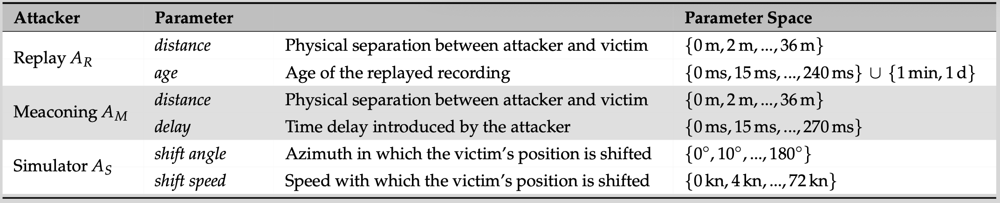

# MARSIM Dataset

The MARSIM Dataset is a collection of simulated pcap files containing NMEA-0183 data streams of diverse GPS spoofing attacks.
This dataset is released together with the paper **[Detecting Maritime GPS Spoofing Attacks Based on NMEA Sentence Integrity Monitoring](https://www.mdpi.com/2077-1312/11/5/928)** (DOI 10.3390/jmse11050928).

### Dataset Details
- 43,320 pcap files
- 120 seconds of recorded network traffic for each file
- Half of the files are spoofed after 60 seconds

### Environment Settings
- Two GPS receivers with IPs 192.168.0.10 and 192.168.0.11
- Receivers are placed 4 meters apart
- Position noise is taken from actual recordings
- RMC, GSV, GSA, GGA, GLL, and VTG sentences of the NMEA-0183 protocol are sent by each receiver in a one-second interval (1 Hz)
- Vessel moves with a speed of 20 kn and turns with 0.5 deg/s
- Internal clock drifts by 10.55 us/s with added normal noise

### Spoofing Settings
- Spoofed pcap files are equally divided into three groups, one for each attacker type: simple attacker (A1), adaptive attacker (A2), and advanced attacker (A3)
- Replay attacker *AR*:
  - Replays a recording of a similar ship that cruises into the same direction
  - The replay lies `age` seconds in the past
  - The replayed route is shifted orthogonal to the unspoofed route by `dist` given in meters
- Meaconing attacker *AM*:
  - Relays the authentic signals from a fixed position with a delay of `delay` given in seconds
  - The attacker has a distance of `dist` meters to the ship at 60 seconds
- Simulator attacker *AS*:
  - Slowly shifts the position away from the actual position
  - The speed at which the position is shifted is determined by `shift speed` given in m/s
  - The direction in which the position is shifted is given by `shift angle` given in deg/s

### Parameter Space
As defined above, we have a two-dimensional parameter space for each attacker type (*AR* with `age` and `dist`, *AM* with `delay` and `dist`, and *AS* with `shift speed` and `shift angle`).
For each dimension of the parameter space, we sample 19 different values.
We generate 20 spoofed and 20 unspoofed recordings for each set of parameters by scanning the two-dimensional space.



## Folder Structure and Naming Convention

The dataset folder contains a `dataset.json` file with the following contents:
```
[
[...]
{
  "filename": "A1-unspoofed-0-distance_to_ship-0-time_difference-0.0.pcap", // The name of the corresponding file
  "scenario": "A1",  // The attacker type
  "label": "unspoofed", // Determines if the file is spoofed or unspoofed
  "index": "0", // Index of the file within the files with the same parametrization
  "parameters": { // Key-value pairs for all applicable parameters
    "distance_to_ship": "0", 
    "time_difference": "0.0"
  }
},
...]
]
```

Each filename carries the same information as provided by the dataset.json and is structured as follows:
```
{scenario}-{label}-{index}-{parameter key 1}-{parameter value 1}-...-{parameter key n}-{parameter value n}.pcap
```

## License

This repository is licensed under a [supplemented MIT License](LICENSE).
